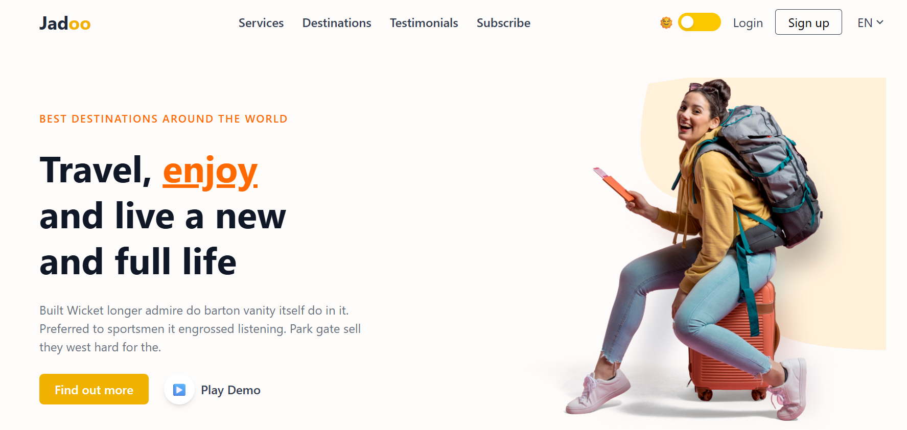

# ✈️ Jadoo Travel - Agency Landing Page

This is my first project where I converted a Figma design into a fully responsive live website using:

- **HTML5**
- **CSS3**
- **Tailwind CSS**
- **JavaScript**

## 🎨 Design Inspiration

Figma to Code Conversion — Travel Agency Landing Page  
Built from scratch, following best practices.

## 🚀 Features

- Clean and modern responsive layout
- Tailwind CSS utility classes
- Hero section with headline and image
- Navigation bar with dark mode toggle (if applicable)
- Sections: Services, Destinations, Testimonials, Subscribe
- Login / Sign-up buttons
- Language selector dropdown
- Responsive for Desktop, Tablet, and Mobile
- Cross-browser compatible

## 🛠️ Tech Stack

- HTML5
- CSS3
- Tailwind CSS
- JavaScript (Vanilla JS)
- Visual Studio Code

## 🌐 Live Demo

[Click here to view](https://your-netlify-link.netlify.app)

## 💡 Lessons Learned

- Figma to HTML + CSS workflow
- Using Tailwind CSS utility classes effectively
- Implementing responsive designs
- Structuring a project for readability
- Organizing code assets (CSS, JS, Images)

## ✨ Demo Preview

  
*(Add a screenshot of your landing page here)*

## 📬 Contact

If you'd like to collaborate or give feedback:  

**MHRX**  
**mehedihasanrabbivip@gmail.com**  
[https://github.com/mehedihasanrabbivip](https://github.com/mehedihasanrabbivip)

